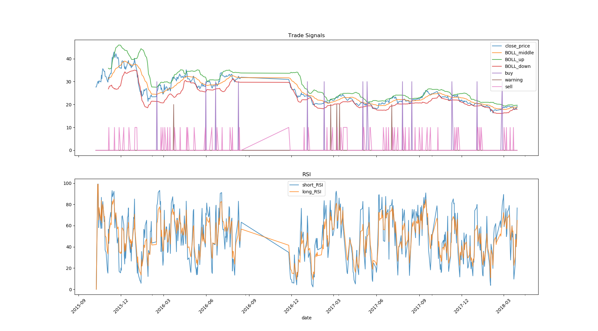

# guoshi quantitative investment tool

A quantitative investment tool based on RSI and BOLL.

## Environment
* Python 3.6
* Matplotlib 2.2.2
* Numpy 1.14.2
* Pandas 0.22.0
* PyMySQL 0.8.0

## Effect

## Attention
In order to use dataset，you need to install MySQL.

See "设计报告.pdf" for more details.

